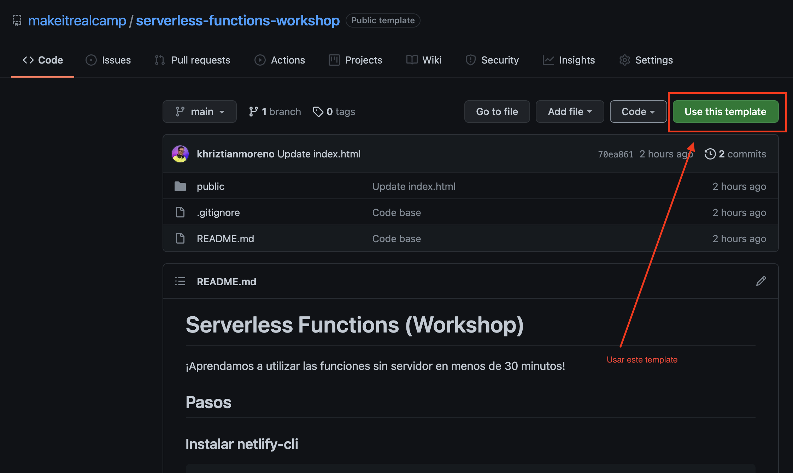
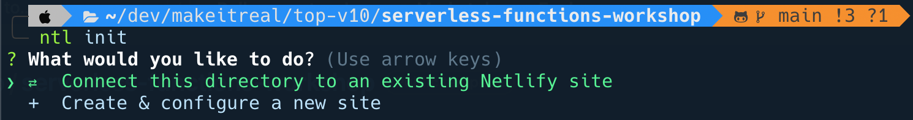
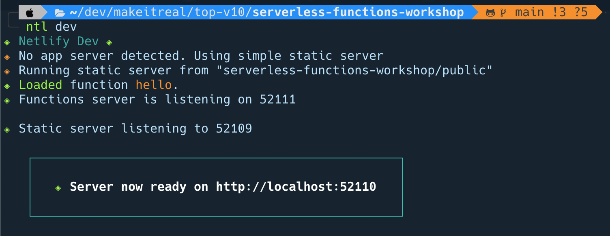
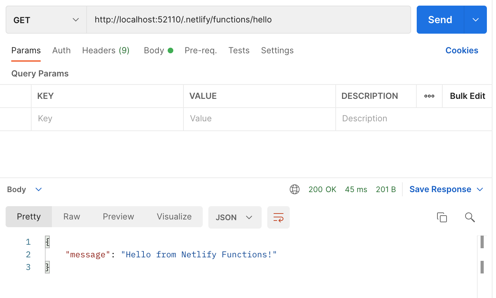

# Serverless Functions (Workshop)
>¡Aprendamos a utilizar las funciones serverless en menos de 30 minutos!

Las funciones serverless están ganando popularidad y Netlify hace que sea más fácil que nunca comenzar. Para agregar funciones serverless a un proyecto, simplemente necesita agregar sus funciones a una carpeta específica e indicarle a Netlify en qué carpeta se encuentran.

## Pasos

## Cuenta en netlify
Debes tener un cuenta en Netlify o [registrarte](https://www.netlify.com/)

### Instalar netlify-cli
```bash
npm i -g netlify-cli
```

Luego de instalar puedes verificar la version

```bash
ntl --version
```

o

```bash
netlify --version
```

## Crear un repositorio
Vas a crear un nuevo repositorio usando este template,  luego vas a clonarlo en tu carpeta local



## Iniciarlizar proyecto
Luego de que clones el repositorio, dentro de la carpeta del proyecto vas a ejecutar el siguiente comando y seguir los pasos que alli te van mostrando.

```bash
ntl init
```


## Crear nuestra Cloud Function
Vamos a crear nuestra primera cloud functions, para ello vamos a crear un archivo en la siguiente ruta. `./src/hello.js`

Puedes puedes hacerlo por tu editor de codigo favorito o por la la terminal
```bash
touch ./src/hello.js
```

En este archivo vamos a escribir el siguiente codigo:

```js
exports.handler = async () => {
  const result = {
    message: 'Hello from Netlify Functions!',
  };

  const response = {
    statusCode: 200,
    headers: {
      'Content-Type': 'application/json',
    },
    body: JSON.stringify(result),
  };

  return response;
};
```

Para probar esta funcion, primero debemos hacer un par de pasos mas.

## Configuración basada en archivos `netlify.toml`
El archivo `netlify.toml` es un archivo de configuración que especifica cómo Netlify construye e implementa su sitio, funciones, incluidos redireccionamientos, configuraciones específicas de contexto y branches, y más.

Para crear este archivo debe estar en toda la raiz del proyecto:

```bash
touch netlify.toml
```

Dentro de este archivo vamos a escribir el siguiente codigo

```toml
[build]
  # src: es la ruta donde estaran nuestras funciones
  functions = "src"
```

Luego de tener este archivo ya podremos probar nuestra funcion

## Ejecutar localmente las funciones
Para probas nuestras funciones de forma local, `netlify-cli`, nos entrega un comando para realizar esto:

```bash
ntl dev
```
Luego de ejecutar este comando veremos en la terminal algo similar a lo que vemos en esta imagen de abajo.



Si abrieramos el navegador y fueramos a esa ruta (http://localhost:52110) veriamos una pagina blanca con un mensaje `Not Found`.

## Consumir una function
Para consultar la funcion `hello` que acabamos de crear debemos agregar a la url del paso anterior el sigueinte path `/.netlify/functions/hello`

Este path `/.netlify/functions` es necesario para poder consumir la function.



Puede que ese path no sea algo muy amigable y dificil de recordar, asi que podemos cambiarlo.

## Redirect
Netlify Functions es una de las formas más fáciles de comenzar con Serverless, pero la ruta predeterminada para llamar a uno es un poco tediosa en `/.netlify/functions/<function_name>`. Veamos cómo simplificar esto para que podamos llamar a `/api/<function_name>`.

Para simplificar la ruta de esta manera, puede agregar la siguiente configuración de redireccionamiento a su `netlify.toml`

```toml
[build]
  functions = "src"
[[redirects]]
  from = "/api/*"
  to = "/.netlify/functions/:splat"
  status = 200
```
¡Esto le dice a Netlify que redirija cada solicitud a `/api/<function_name>` a la ruta completa de `/.netlify/functions/<function_name>` exactamente como lo desea!

## Desplegar

Para desplegar nuestras funciones  directamente a netlify ejecutamos el siguiente comando en toda la raiz del proyecto

```bash
ntl deploy
```

O podrias hacer un push de tu proyecto e inmediatamente el CI de netlify desplegara esto.

## Tarea

1. Vas a crear una function serverless que permita buscar los gists de github de un usuario cualquiera.
2. Crearas una function serverless que solo acepte el metodo `POST` y reciba en el cuerpo de la solicitud `name` y `yearBirth` y de como resultado un mensaje como `${NAME} tu edad actual es {AGE}`
